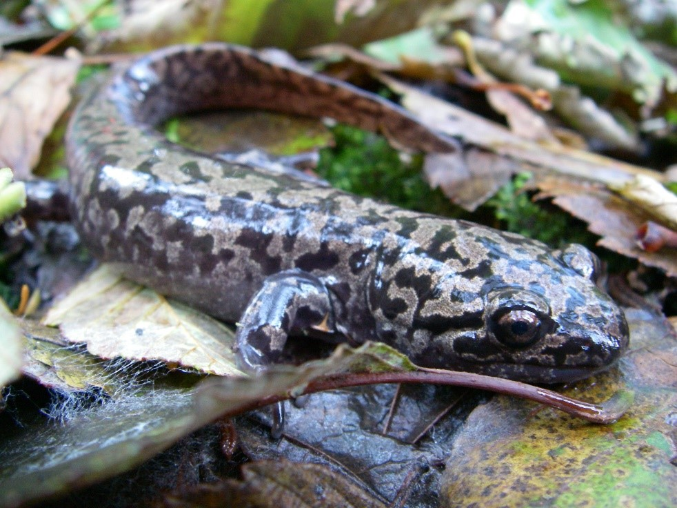

```{r setup, include=FALSE}
knitr::opts_chunk$set(echo = FALSE, warning = FALSE, message = FALSE)
```

```{r}
library(tidyverse)
library(janitor)
library(broom)
library(kableExtra)
library(here)
library(ggridges)
library(ggbeeswarm)
library(scales)
library(effsize)

m_c_verts <- read_csv(here::here("data","mack_creek_vertebrates.csv")) %>% 
  clean_names() %>% 
  filter(species %in% c("DITE")) %>% 
  filter(unittype %in% c("P","C","SC"))%>% 
  mutate(section_full = case_when(section=="CC"~"Clear cut",T~"Old growth")) %>% 
  mutate(unittype_full = case_when(unittype == "P"~"Pool",
                                   unittype == "SC"~"Side channel",
                                   unittype == "C"~"Cascade"))

```


## Introduction

Since inauguration by the US Forest Service in 1948, H.J. Andrews Experimental Forest has proved an incredibly valuable research asset. {website citation}. Countless studies have been completed spanning topics from logging hydrology to spotted owl demography. {website citation}. More recent research examples include monitoring vertebrate populations native to Mack Creek (Figure 2).  Using vertebrate data from this research, the potential impact of forest condition may have on Pacific Giant Salamanders (Dicamptodon tenebrosus) is explored. {maybe mention something on at risk status based on habitat loss if we can find a source}


```{r out.width = "65%", out.height = "70%", fig.align = 'center', fig.cap = "**Figure 1:**Pacific Giant Salamander ( Dicamptodon tenebrosus) in its natural habitat."}

```


## Data and Methods

Provided by Andrews Forest LTER Site, the weight and abundance data are part of an aquatic vertebrate population study and monitoring program conducted by Oregon State University. Though the program’s inception dates back to 1987, Pacific Giant Salamanders have only been monitored since 1993{site metadata}.  Initial analysis entails, salamander population counts grouped annually based on the type of forest section (old growth or clear cut) they were observed and is visualized via line graph. Next the scope narrows to salamanders observed in 2017 in order to construct a table illustrating salamander catch location (cascades, pool, side channel) that reflects relative percentage to total population of old growth and clear-cut forest sections along Mack Creek.  A chi-square test was then performed for insight about forest condition and its potential effect on salamander location. Finally, mean weights are grouped by forest condition and catch location and then compared via two sample t-test (Welch's t-test, $\alpha = 0.05$) and violin plot respectively. All analyses and figures were prepared using R software version 3.6.1.


```{r out.width="50%", out.height="50%", fig.align='center', fig.cap= "**Figure 2:** Map of Mack Creek"}
knitr::include_graphics("mack_creek_map.png")
```


## Results

A.

####Annual salamander counts in old growth vs clear cut forests.

Over the majority of years observed, old growth salamander populations exceed clear cut forest populations. The exceptions to this are seen in 1993 and 1994 at the start of data collection as well as from 2015 to 2017 samples where clear cut salamanders exhibit higher counts.

Additionally, the plots mirror each other’s general trend. In other words, an increase in one population for a given year typically saw a similar response by the other population.


#### Pacific giant salamander population changes over time


```{r, fig.cap="**Figure 1**: Old growth and clear cut regional populations tend to vary similarly, however the clear cut population is generally lower than the old growth populations."}
giant_sal_counts <- m_c_verts %>% 
  count(year, section_full)

giant_sal_counts %>% 
  ggplot(aes(x = year, y = n)) +
  geom_line(aes( group = section_full, 
                 color = section_full),
            size = 1.05) +
  ggtitle("Old growth vs clear cut Pacific Giant Salamander populations ") +
  labs(subtitle = "Timeframe: 1993 to 2017") +
  xlab( "Year") +
  ylab("Salamander count") +
  scale_x_continuous(breaks = seq(1993,2017,by=4)) +
  theme_classic() +
  theme(plot.title = element_text(hjust = 0.5),
        plot.subtitle = element_text(hjust = 0.5),
        legend.position = c(.15, .7))


  
  
  ##### need to fix title legend title.  Caption text looks funky with fig
```


#### Pacific giant salamander population distributions in 2017

```{r}
giant_sal_2017_counts <- m_c_verts %>% 
  filter(section %in% c("OG", "CC")) %>% 
  filter(unittype %in% c("P", "C", "SC")) %>% 
  filter(year == "2017") %>% 
  count(section_full, unittype)

giant_sal_2017_table <- giant_sal_2017_counts %>% 
  pivot_wider(names_from = unittype,
               values_from = n)
  
 giant_sal_2017_props <- giant_sal_2017_table %>%  
   adorn_percentages(denominator = "row") %>% 
   adorn_pct_formatting(digits = 1) %>% 
   adorn_ns(position = "front")
 
 kable(giant_sal_2017_props,
       caption = "Table 1: Salamander count by location found in channel (2017)",
       col.names = c( "Forest condition", 
                      "Cascades", 
                      "Pool", 
                      "Side channel")) %>% 
   kable_styling("striped", 
                 full_width = F)
 


```


```{r}
# Exploring if forest condition has a significant effect on salamander catch location via chi squared test.

giant_sal_chi_counts <- giant_sal_2017_table %>% 
  select(-section_full)

##List H0 and Hother one

giant_sal_chi <- chisq.test(giant_sal_chi_counts)


```

B.

####2017 Counts by Classification

Next, 2017 salamander counts grouped by catch location were analyzed and demonstrated that in both clear cut and old growth forest sections, cascades hold the majority of salamander populations followed by side channels and pools respectively. The results presented in Table 1 were then further examined using a chi squared test to determine if forest condition had a significant effect on salamander catch location.  No significant association was found through testing (chi-square test, p = `r round(giant_sal_chi$p.value,digits=3)`)


Based off the p value retain null hypothesis that there is no significant association between forest condition and location in channel found.


#### Comparison of weights of Pacific giant salamanders in clear cut and old growth forest sections of the creek in 2017.


```{r}
d_data <- m_c_verts %>% 
  filter(year==2017) %>%
  filter(weight != "NA") %>% 
  select(section,weight)
```


```{r}
cc_w <- d_data %>% filter(section == "CC") %>% select(weight)
og_w <- d_data %>% filter(section == "OG") %>% select(weight)


cc_mean <- round(mean(cc_w$weight), digits = 3)
og_mean <- round(mean(og_w$weight), digits = 3)

d_test_raw <- t.test(weight~section,d_data,paired = FALSE)

d_test <- broom::tidy(d_test_raw)

d_pctdiff <- scales::percent(abs(d_test$estimate1 - d_test$estimate2)/mean(c(d_test$estimate1,d_test$estimate2)))
```

Populations found in clear cut and old growth sections of the creek demonstrated statistically significant differences in mean weights (p = `r round(d_test$p.value,digits=3)`, $\alpha$ = 0.05). The percent difference between the mean weights is `r d_pctdiff` (Clear cut mean = `r cc_mean` g, Old growth mean = `r og_mean` g).

#### Comparison of weights of Pacific giant salamanders in pools, cascades and side-channels of Mack Creek in 2017.

```{r}
e_data <- m_c_verts %>% 
  filter(year==2017) %>%
  filter(weight != "NA") %>% 
  select(unittype,weight)

e_mean <- e_data %>% 
  group_by(unittype) %>% 
  summarize(mean = mean(weight),
            sd = sd(weight))
```

```{r}
e_plot <- ggplot(data = e_data)+
  geom_violin(aes(x=unittype,y=weight))+
  geom_errorbar(data = e_mean, aes(x= unittype,ymax=mean+sd, ymin=mean-sd))+
  geom_point(data = e_mean, aes(x=unittype,y=mean))

e_plot
```

```{r}
e_anova_raw <- aov(weight~unittype, data = e_data)

e_anova <- broom::tidy(e_anova_raw)

c_p_cohen <- cohen.d(weight~unittype, data=e_data %>% filter(unittype != "SC"))
p_sc_cohen <- cohen.d(weight~unittype, data=e_data %>% filter(unittype != "C"))
c_sc_cohen <- cohen.d(weight~unittype, data=e_data %>% filter(unittype != "P"))
```

There is a statistically significant difference between mean weights of salamanders in the three channel classifications (p = `r round(e_anova$p.value[1], digits = 3)`). A pairwise comparison of the effective size (Cohen's d) was found to be negligible when comparing cascades and pools ($d=$ `r round(c_p_cohen$estimate,digits=3)`), and small when comparing side channels to pools ($d=$ `r round(p_sc_cohen$estimate,digits=3)`), and side channels to cascades ($d=$ `r round(c_sc_cohen$estimate,digits=3)`). Despite this statistical difference, it is difficult to determine which channel classifications have differences without post-hoc testing. Further analysis using a pairwise comparison of channel classifications, such as Tukey's Honest Significant Difference, could be used to determine which groups exhibit statistically significant differences.

## Summary

## References
 { ############ need to be cleaned #######################}
Introduction website source --------- https://andrewsforest.oregonstate.edu/about/history

Sal picture source------- File:Dicamptodon tenebrosus 2.JPG. (2019, June 14). Wikimedia Commons, the free media repository. Retrieved 00:25, December 3, 2019 from https://commons.wikimedia.org/w/index.php?title=File:Dicamptodon_tenebrosus_2.JPG&oldid=354477061.

Map source --------------Source: Characterizing short-term light dynamics in forested headwater streams - Scientific Figure on ResearchGate. Available from: https://www.researchgate.net/figure/Map-of-study-sites-and-the-HJ-Andrews-Experimental-forest-HJA-Each-dot-represents-a_fig1_314206020 [accessed 3 Dec, 2019]


